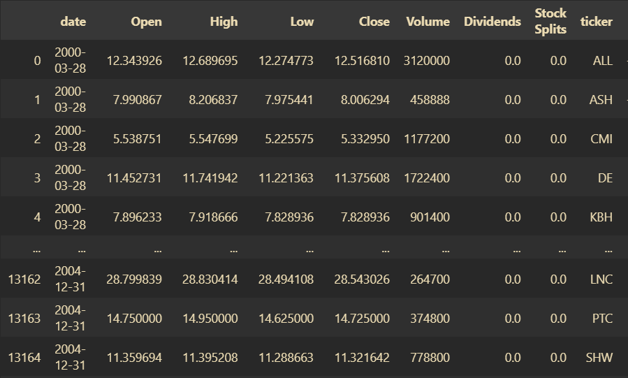

# Portfolio Optimization Environment

A Gymnasium-compatible portfolio optimization environment design for reinforcement learning research in financial trading.

The environment is meant to model a multi-asset portfolio allocation task where an agent observes historical market features, chooses portfolio weights, and receives rewards based on portfolio value after costs.

## What It Covers

- Multi-asset portfolio allocation
- Continuous action space for portfolio weights
- Lookback-window based observations
- Transaction cost and tax assumptions
- Compatibility with reinforcement learning libraries such as Stable-Baselines3 and ElegantRL

## Core Concepts

The intended environment is organized around two responsibilities:

- `AssetManager`: portfolio accounting, asset valuation, order execution, and state updates.
- `PortfolioOptEnv_gym`: Gym/Gymnasium-style environment API with `reset`, `step`, reward calculation, and episode metrics.

## Data Format

Input data should include timestamped OHLCV-style market data and one row per asset per timestamp. Columns after `ticker` can be used as model features.



## Example Usage

```python
import pandas as pd
from stable_baselines3 import PPO
from stable_baselines3.common.vec_env import SubprocVecEnv

from env import PortfolioOptEnv_gym

train_data = pd.read_parquet("data/train.parquet")

env_args = {
    "env_name": "PortfolioOptEnv",
    "num_envs": 4,
    "max_step": 1_000,
    "status": "train",
    "state_dim": 128,
    "action_dim": 10,
    "if_discrete": False,
    "lookback_window": 20,
    "total_value": 1_000_000,
    "commision": 0.001,
    "tax_rate": 0.0,
    "device": "cuda",
    "data": train_data,
    "cwd": "./experiments/ppo/demo",
}

train_env = PortfolioOptEnv_gym(**env_args)
train_env = SubprocVecEnv([lambda: train_env for _ in range(env_args["num_envs"])])

model = PPO("MlpPolicy", train_env, verbose=1, seed=42)
model.learn(total_timesteps=100_000)
model.save("./experiments/ppo/demo/model/last_model")
```

## Install Dependencies

```bash
git clone https://github.com/novis10813/RL-PortfolioOptimization-Env.git
cd RL-PortfolioOptimization-Env
pip install -r requirements.txt
```

## Repository Status

This public repository currently contains the environment documentation, dependency list, and data-format reference image. Treat it as a lightweight reference snapshot for the environment interface and expected data shape.

## License

MIT. See `LICENSE`.
